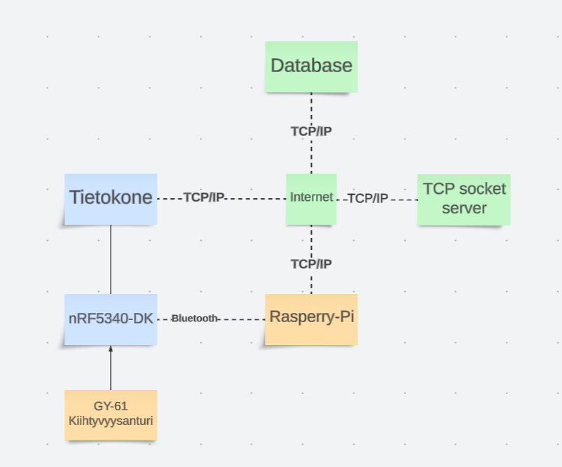

# Tietoliikenteen sovellusprojekti

# Projektin kuvaus

Projektin tehtävänä on suunnitella Thingylle client, joka mittaa anturidataa kiihtyvyysanturilta ja välittää tietoa langattomasti IoT-reitittimelle (Raspberry Pi). Raspberry välittää dataa Oamkin MySQL-palvelimelle.

Tietokantaan tallentuvaan dataan on TCP-sokettirajapinta ja yksinkertainen HTTP API. Kerättyä dataa haetaan HTTP-rajanpinnasta omaan kannettavaan koodatulla ohjelmalla ja käsitellään koneoppimistarkoituksiin.

## Projektin arkkitehtuurikuva

