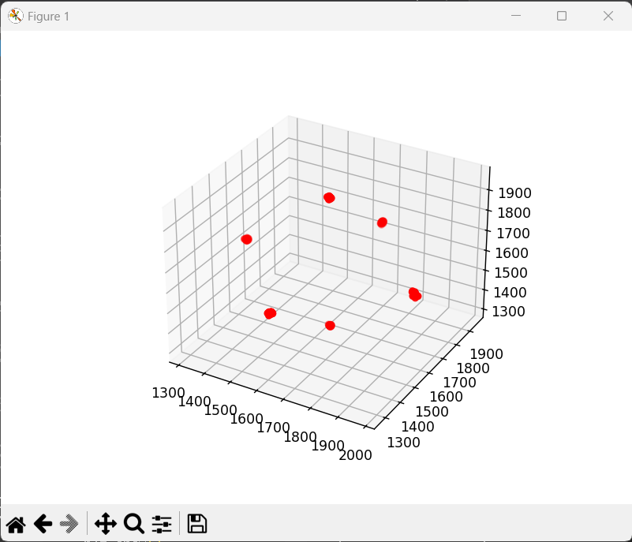
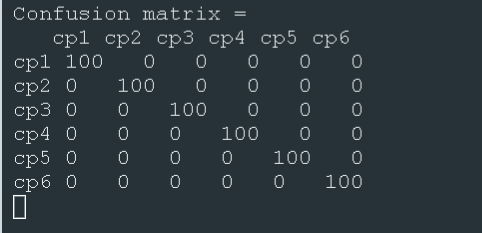

# Tietoliikenteen sovellusprojekti

# Projektin kuvaus

Projektissa käytetyt ohjelmat ja komponentit:
  - Visual Studio Coden C-kieliset ohjelmat: Kiihtyvyysanturin dataa mittaava ohjelma, Bluetoothin toiminnan mahdollistava ohjelma, sekä nRF5430-DK alustan käytön ohjelma.
  - Visual Studio Coden Python ohjelmat: Mittausdatan luku, käsittely ja lähettäminen MySql tietokantaan(Raspberry pi 3:n kautta), K-means opetusalgoritmin toteutus 3D-mallinnuksella ja opetusalgoritmin  tehokkuuden testaus ohjelma
  - Kiihtyvyysanturi GY-61
  - Nrf Connect
  - Nordic nRF5340-DK alusta
  - Raspberry pi 3
  - MySQL tietokanta
  - Linux serverille tehdyt Php-skriptit ja apache 2 web palvelin 

Projektin tehtävänä oli suunnitella nRF5340 Development Kit -alustalle client, joka mittaa anturidataa kiihtyvyysanturilta ja välittää tietoa langattomasti IoT-reitittimelle (Raspberry Pi). Raspberry välittää dataa Oamkin MySQL-palvelimelle.

Tietokantaan tallentuvaan dataan on TCP-sokettirajapinta ja yksinkertainen HTTP API. Kerättyä dataa haetaan HTTP-rajanpinnasta omaan kannettavaan koodatulla ohjelmalla ja käsitellään koneoppimistarkoituksiin.

## Projektin arkkitehtuurikuva

## K-means algoritmin toiminta, sekä 3D-mallin lopputuloksen kuva
K-means algoritmi ottaa tietokannasta mittausdatan, jonka avulla se vertaa aina kuuden arvotun pisteen etäisyyksiä mittausdatan datapisteisiin. Pienimmän etäisyyden saanut piste voittaa ja winner count kasvaa yhdellä (jos jokin arvottu keskipiste jää voitoitta, ohjelma arpoo uuden pisteen). Ohjelma toistaa koko datan läpikäynnin tällä tavalla 5 kertaa. Opetuskierrosten avulla keskipisteet asettuvat oikeille paikoille, eivätkä enään liiku. Alla oleva kuva on ohjelman tulostama 3D-malli lopputuloksesta 5 opetuskierroksen jälkeen.

## Confusion matrix, kuvaus K-means algoritmin toimivuudesta
Confusion matrix K-means luokittelu algoritmin toiminnasta/hyvyydestä. Matriisi todentaa K-means algoritmilla luotujen keskipisteiden paikkansapitävyyden kun sille annetaan uusia anturiarvoja joista se mittaa etäisyyksiä annettuihin keskipisteisiin ja tunnsitaa niisä lähimmän ja lisää yhden arvon matrisiin keskipisteen kohdalle. Tällä voimme todistaa, että keskipiste sijaitsee oikeassa x,y,z suunnassa.

